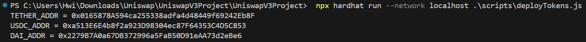

# Uniswap V3 Project - IT4527E

## Install
Required Hardhat
```code
npm install
npx hardhat node
```

## Usage
### Deploy
```code
npx hardhat run --network localhost ./scripts/deployContracts.js
```

```code
npx hardhat run --network localhost ./scripts/deployTokens.js
```

```code
npx hardhat run --network localhost ./scripts/deployPools.js
```


## Functionality
### AddLiquidity.js
Add liquidity to the created pools, and also calculate the nearest usable tick range.

### SwapUSDx\_to\_USDy.js
Swap functionality to swap between USDT and USDC, using the `exactInputSingle()`.

In case of the token swapping from's balance is insufficient, the process is terminated.

### FlashSwap.js
In this deployed environment, with 3 different pools of USDC and USDT tokens, `FlashSwap.js` script will call all deployed contracts (including pools), to perform flash loan in pool `USDT_USDC_500`, and use the funds to make swaps on other pools to gain profit.


